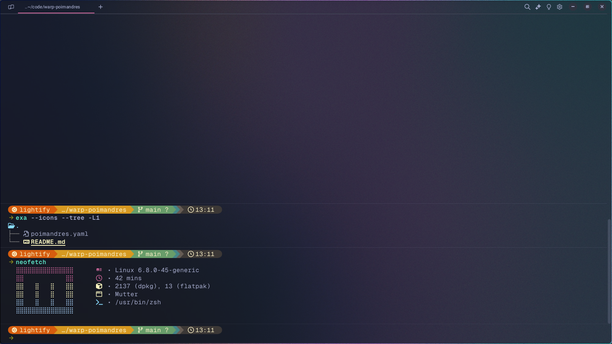

# warp-poimandres
Poimandres theme on warp

Based on original poimandres theme but with a nice background.

Preview:



# Installation

1. Copy Paste the following code into your terminal:

```bash
git clone https://github.com/lightify97/warp-poimandres
cd warp-poimandres
cp ./poimandres.yaml ./background.jpg ~/.warp/themes/
```

2. Open command pallete and select the theme `poimandres` from the theme picker.


